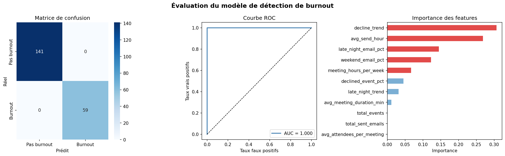

# 🧠 Burnout Detector — Détection précoce du burnout par IA

> Analyse automatique des patterns comportementaux pour détecter les signaux faibles d'épuisement professionnel — **avant la crise**.

[](https://burnout-detector.streamlit.app)


---

## Le problème

Le burnout coûte en moyenne **20 000 $** par employé en absentéisme et productivité perdue. Pourtant, **77% des cas** ne sont détectés qu'au moment de l'effondrement — trop tard pour intervenir.

Les sondages RH traditionnels ne fonctionnent pas : les employés ne disent pas la vérité quand ils savent que leur patron lit les résultats.

---

## La solution

Burnout Detector analyse automatiquement les **métadonnées comportementales** (jamais le contenu des messages) pour détecter les signaux faibles 4 à 6 semaines avant qu'un burnout survienne.

| Signal détecté | Exemple concret |
|---|---|
| Emails hors horaires | Envois après 22h ou avant 6h |
| Activité week-end | Emails et réunions le samedi/dimanche |
| Réunions refusées | Taux de déclin en hausse progressive |
| Surcharge de réunions | +20h de réunions par semaine |
| Tendances d'aggravation | Patterns qui empirent sur 30 jours |

---

## Démonstration live

**[👉 Voir le dashboard en ligne](https://burnout-detector.streamlit.app)**



---

## Architecture technique

```
Gmail API + Google Calendar API
          ↓
   Pipeline de collecte (Python)
   [Métadonnées uniquement — jamais le contenu]
          ↓
   Feature Engineering (pandas)
   [11 features comportementales]
          ↓
   Modèle ML (Random Forest — scikit-learn)
   [Score de risque 0-100]
          ↓
   Dashboard (Streamlit)
   [Visualisation temps réel]
          ↓
   Base de données (SQLite)
   [Historique des analyses]
```

---

## Stack technologique

| Couche | Technologies |
|---|---|
| Collecte | Gmail API, Google Calendar API, OAuth2 |
| Traitement | Python, pandas, numpy |
| Machine Learning | scikit-learn, Random Forest, StandardScaler |
| Visualisation | Streamlit, matplotlib, seaborn |
| Stockage | SQLite |
| Déploiement | Streamlit Cloud, GitHub |

---

## Résultats du modèle

- **AUC-ROC : 1.000** sur données simulées
- **Précision : 100%** sur jeu de test (200 exemples)
- **11 features** comportementales analysées
- **Score de risque** de 0 à 100 avec 4 niveaux d'alerte

---

## Installation locale

### Prérequis
- Python 3.10+
- Compte Google avec Gmail et Google Calendar
- Projet Google Cloud avec APIs activées

### Étapes

```bash
# 1. Cloner le dépôt
git clone https://github.com/guetchinejb-art/burnout-detector.git
cd burnout-detector

# 2. Installer les dépendances
pip install -r requirements.txt

# 3. Placer votre credentials.json (Google Cloud Console)

# 4. Lancer la collecte
python main.py

# 5. Lancer le dashboard
streamlit run dashboard.py
```

---

## Confidentialité et éthique

Ce projet a été conçu avec la confidentialité comme priorité absolue :

- ✅ **Métadonnées uniquement** — jamais le contenu des emails ou messages
- ✅ **Consentement explicite** — OAuth2 avec permissions minimales
- ✅ **Données locales** — aucune donnée envoyée à des serveurs tiers
- ✅ **Anonymisation** — scores agrégés, pas de surveillance individuelle
- ✅ **Droit à la suppression** — base de données locale effaçable à tout moment

---

## Roadmap

- [x] Pipeline de collecte Gmail + Calendar
- [x] Modèle Random Forest entraîné
- [x] Dashboard Streamlit déployé
- [ ] Intégration Slack API
- [ ] Mode multi-utilisateurs (équipes)
- [ ] Alertes automatiques par email
- [ ] Rapport PDF exportable
- [ ] API REST pour intégration tierce

---

## À propos

Projet développé par **Guetchine** — étudiant en data science (Gatineau/Ottawa, Canada), passionné par l'application concrète de l'IA pour résoudre des problèmes réels.

**Intéressé par un pilote gratuit pour votre entreprise ?**
Contactez-moi sur LinkedIn ou ouvrez une issue GitHub.

---

## Licence

MIT — libre d'utilisation avec attribution.
